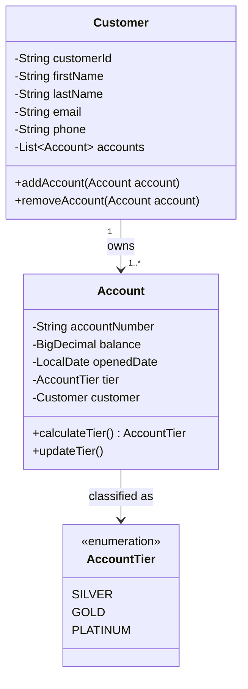
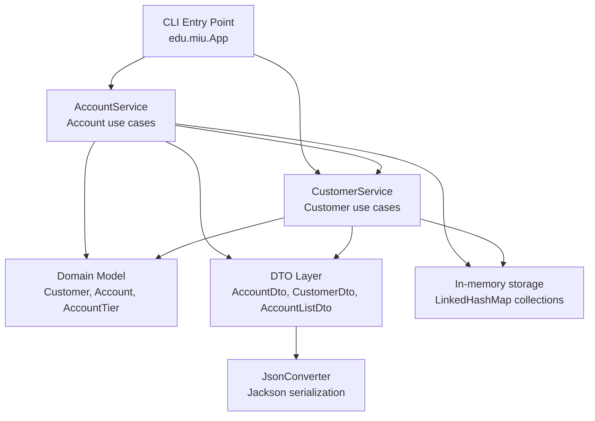

# CS425 Banking Corporation CAMS

Command-line Customer-Accounts Management System (CAMS) for CS425 Banking Corporation.

## Objective

Design and implement a Java CLI banking application with Maven build automation, an executable JAR artifact, and GitHub Actions CI.

## Problem Summary

The bank manages customers and their accounts. Each customer can own one or more accounts, and each account belongs to exactly one customer.

Accounts are classified into these tiers:

| Tier | Rule |
| --- | --- |
| Silver | Account has been open for at least 2 years and has a balance of at least 10,000 dollars |
| Gold | Account has been open for at least 5 years and has a balance of at least 50,000 dollars |
| Platinum | Account has been open for at least 10 years and has a balance of at least 100,000 dollars |

The bank also needs its liquidity position, calculated as the sum of all account balances.

## Domain Model



## Solution Architecture



The design separates responsibilities by layer:

| Layer | Responsibility |
| --- | --- |
| CLI | Starts the application, loads sample data, displays required JSON output |
| Service | Implements customer/account use cases and business rules |
| Model | Represents the domain entities and tier calculation behavior |
| DTO | Shapes JSON output without circular object references |
| Utility | Converts response objects to JSON |
| Storage | Uses in-memory maps as allowed by the assignment |

## Implemented Features

1. Displays all accounts in JSON format.
2. Includes customer data and account tier in each account result.
3. Sorts all accounts by balance in descending order.
4. Displays the bank liquidity position after the all-accounts list.
5. Displays only Platinum tier accounts in JSON format.

## Project Structure

```text
src/main/java/edu/miu
|-- App.java
|-- dto
|   |-- AccountDto.java
|   |-- AccountListDto.java
|   `-- CustomerDto.java
|-- model
|   |-- Account.java
|   |-- AccountTier.java
|   `-- Customer.java
|-- service
|   |-- AccountService.java
|   `-- CustomerService.java
`-- util
    `-- JsonConverter.java
```

## Runtime Requirements

- Java 17
- Apache Maven 3.8 or newer

## Build

```bash
mvn clean package
```

This creates an executable JAR:

```text
target/Trial-1.0-SNAPSHOT.jar
```

## Run

```bash
java -jar target/Trial-1.0-SNAPSHOT.jar
```

## CI/CD

The repository includes a GitHub Actions workflow at `.github/workflows/maven.yml`.

The workflow runs on pushes and pull requests to `main`, sets up Java 17, and builds the project with Maven:

```bash
mvn -B package --file pom.xml
```
